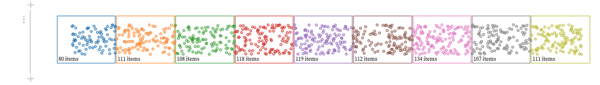
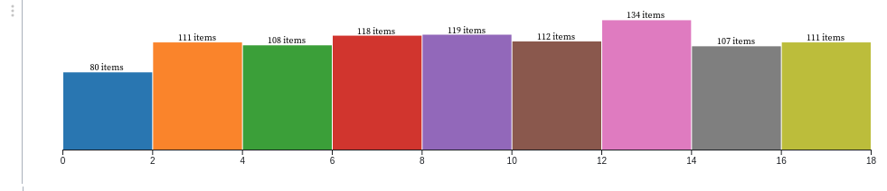

# D3.JS

## Framework JavaScript pour la visualisation de données.

---

### Documentation

Lien vers la [documentation officielle](https://github.com/d3/d3/wiki)

### Importation

Pour importer la librairie, il faut inclure ce script dans la page html désirée (tout en bas).

```js
<script src="https://d3js.org/d3.v6.min.js"></script>
```

Il est possible également de l'importer directement dans un fichier `.js` avec cette commande :
(A noter qu'il faut être dans un environnement qui supporte ES modules)

```js
import * as d3 from "d3";
```

### Selection

Pour la sélection des items à modifier sur la page `html`, le framework dispose d'un sélecteur intégré :

```js
// Sélection de tous les paragraphes p et ajout d'une couleur bleue
d3.selectAll("p").style("color", "blue");

// Sélection d'un node individuel (ici body) et ajout d'une couleur de fond noire
d3.select("body").style("background-color", "black");
```

### Transition animée

Pour réaliser des transitions animées il faut utiliser la fonction `.transition()`.
Voici un exemple pour faire un `fading` sur la couleur de fond d'une page :

```js
d3.select("body").transition().style("background-color", "black");
```

Autre exemple pour faire redimensionner des cercles issus d'un symbole et avec un délai :

```js
d3.selectAll("circle").transition().duration(750).delay(function(d, i) { return i * 10; }).attr("r", function(d) { return Math.sqrt(d * scale); });
```

### Exemples graphiques

- Exemple d'un histogramme :

```js
// On définit un opérateur bin
bin1 = ƒ(r)
bin1 = d3.bin()
```

```js
// On définit buckets et on lui donne les valeurs, ici values1
buckets1 = bin1(values1)
```

```js
// Représentation de nos valeurs sous formes de bins (points)
draw_buckets(bin1, values1)
```



```js
// Création de l'histogramme à partir des bins 
draw_histogram_from_buckets(buckets1, x, {width, yText: "absolute frequency (#)"})
```

